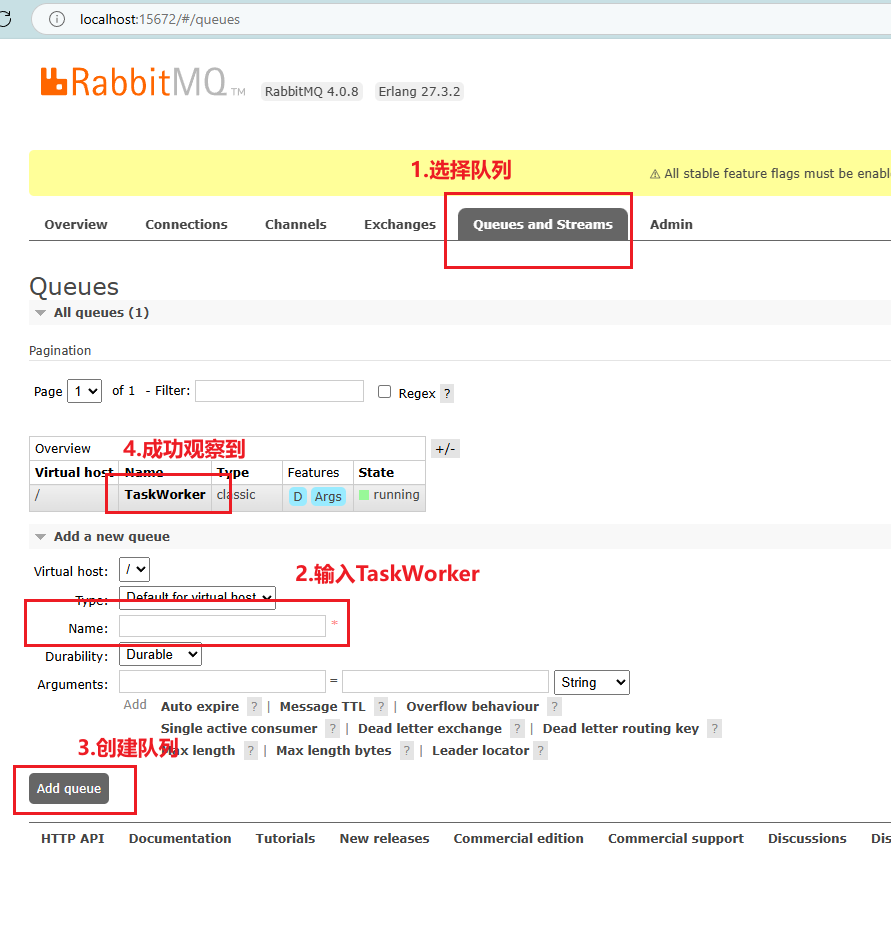
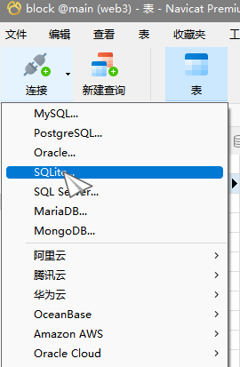
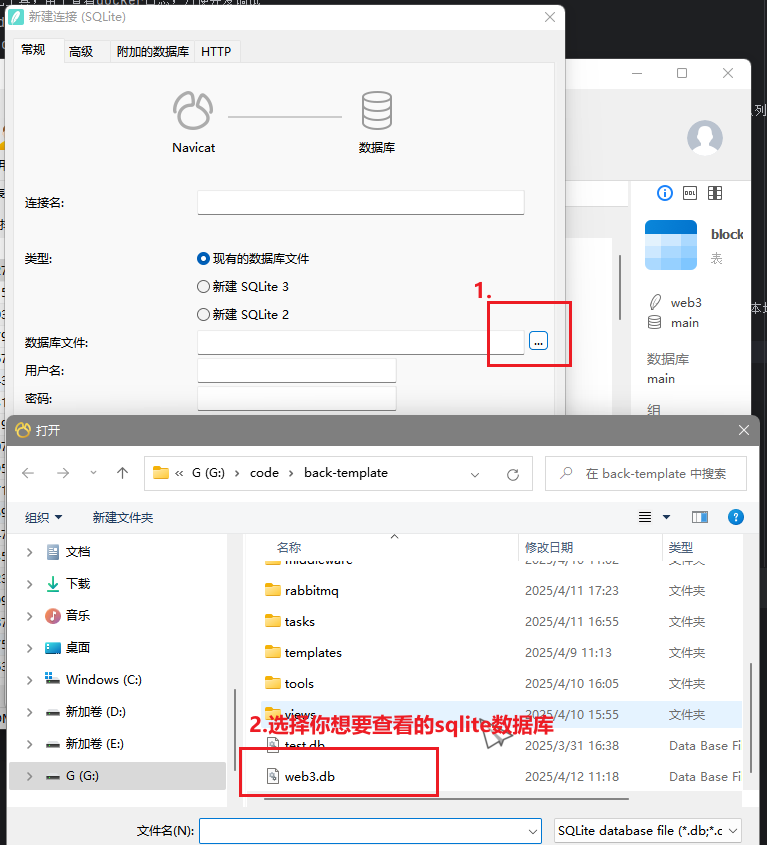
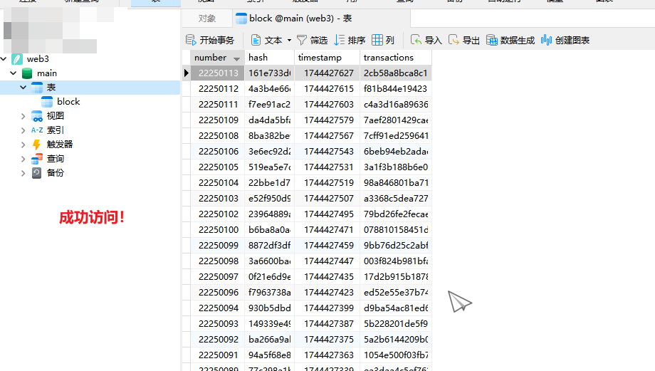

# back-template-swap
本项目是采用模板开发的一版链上分析demo，同时对先前的demo进行了一些性能的优化和功能的完善

## 启动流程（Windows为例）
1. 使用docker desktop可视化工具，用于查看docker日志，方便开发调试
2. 本项目使用Dockerfile + docker-compose.yaml的形式
   启动项目时，先使用docker-compose build构建项目，再使用docker-compose up -d启动项目
   停止项目可使用docker-compose stop（只需重新启动即可），移除项目可使用docker-compose down（如有修改则需要重新build再启动）
3. 如果项目没有rabbitmq文件夹（这是一个挂载到docker容器的本地文件夹，持久化了对应的mq信息，默认已经给出了，可以直接用我给的） 
   那么启动项目后，使用docker desktop会观察到task-worker服务一直在重试，通过docker日志报错，可以很清楚的看到，源头是没有创建TaskWorker队列
   如何创建队列？
   使用命令行，进入到你本地的项目目录下，比如我的目录是“G:\code\back-template-swap>”
   然后在该目录下执行docker exec -it rabbitmq bash，进入rabbitmq容器的控制台
   接着执行rabbitmq-plugins enable rabbitmq_management，这样子就能成功在本地访问到15672端口（参考图片）
   
   创建完队列之后，你就能通过docker desktop观察到task-worker服务正常执行，同时还不断通过定时任务获取区块的最新数据

## 使用Navicat可以查看数据库
由于该项目已经在docker-compose.yaml文件中做了挂载，所以能够在不同的服务之间（即template-server和task-worker）共享数据，同时持久化数据到本地数据库，具体实现可自行查看docker-compose.yaml文件
那如何使用Navicat查看sqlite数据库数据？

